# Developer Footprint

**Know who built it. Verify the claim.**

An open, vendor-neutral protocol for **verifiable software authorship, contribution, maintenance
and project provenance**, with a CLI, a JavaScript SDK, and a drop-in badge for any website.

> Developer Footprint does not track application users, collect hidden telemetry, or require
> runtime network requests. Nothing in this repository phones home.

<p align="center">
  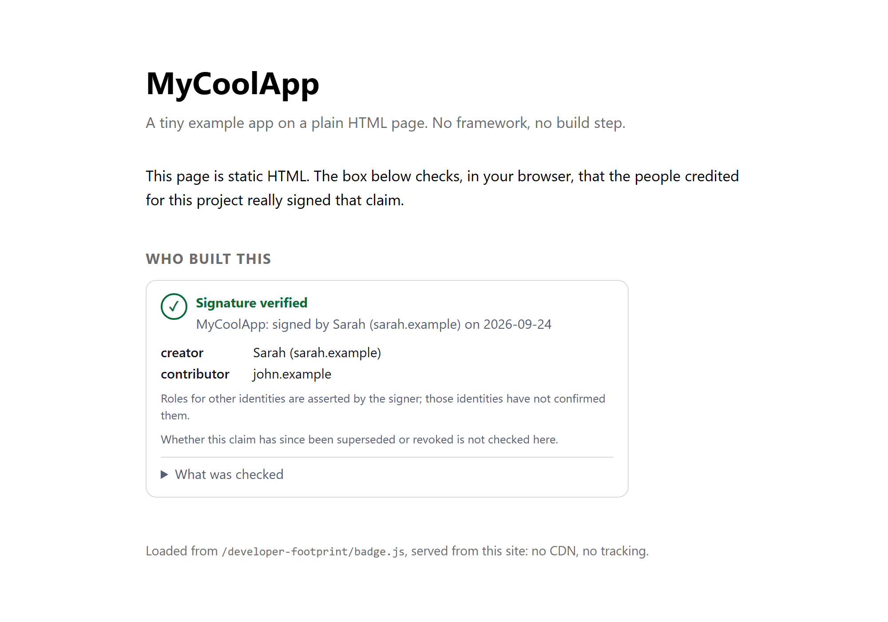
</p>

That box is a real screenshot of the plain HTML page in [`examples/plain-html`](examples/plain-html),
verified in the visitor's browser: **no framework, no build step, no CDN, no tracking**. Someone
credited for a project signs that claim with a key only they hold, and anyone can check it.

- [What it is](#what-it-is) · [Quick start](#quick-start-five-minutes) · [How verification works](#how-verification-works)
- [**No computer of your own? Work laptop?**](#no-computer-of-your-own-a-work-laptop-a-borrowed-pc) (creating IDs and keys anywhere)
- [**Use it on a website**](#put-it-on-a-website) (plain HTML, React, Next.js, Vue, Nuxt, Svelte, Astro, Angular, static sites, CMSs)
- [CLI reference](#cli-reference) · [SDK](#sdk) · [Security model](#security-and-privacy-model) · [Status](#status-what-is-and-is-not-built)

---

## What it is

A **footprint** is a small JSON document that credits identities with explicit roles on a project.
One of those identities **signs** it. Anyone with the footprint, the signature and the signer's
public identity document can check the claim, **offline**, without asking anyone's permission.

| Question                               | How it is answered                                                                        |
| -------------------------------------- | ----------------------------------------------------------------------------------------- |
| Who created / maintains / contributed? | Explicit roles: `creator`, `author`, `maintainer`, `contributor`, `owner`, `organization` |
| Can that be verified?                  | Ed25519 signature over a canonical statement                                              |
| Where does the signer's identity live? | `https://their-site/.well-known/developer-footprint.json`                                 |
| Does it depend on one company?         | No. If any hosted service vanished, signed footprints still verify                        |

**It is not** a badge from a vendor, an analytics package, a reputation score, or a mandatory
account. Installing it proves nothing; a claim exists only when a person signs one.

## Quick start (five minutes)

Needs [Node.js](https://nodejs.org) 22 or newer. Nothing to install: `npx` runs it.

### 1. Create your identity and describe the project

```bash
npx developer-footprint init
```

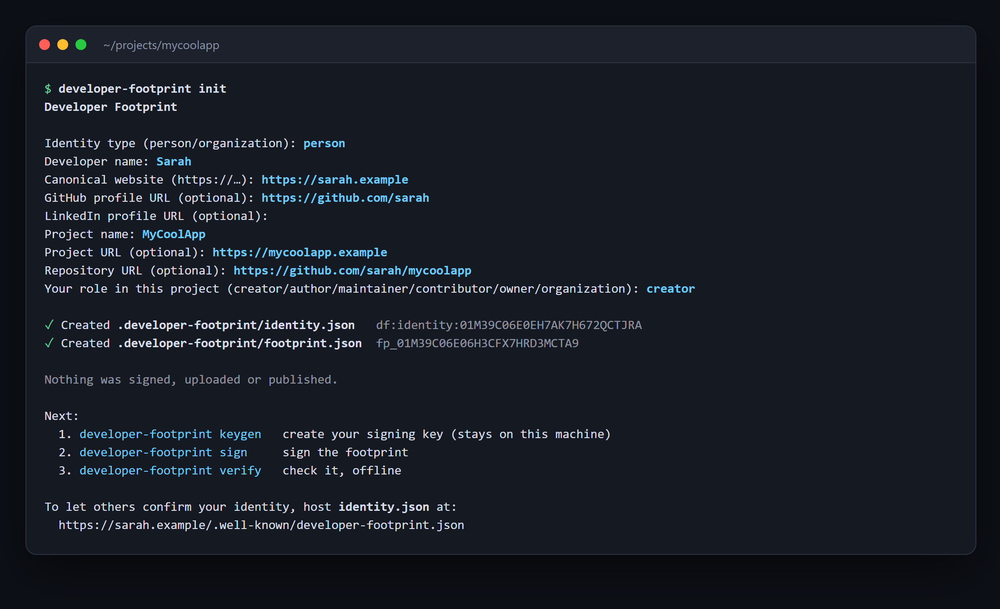

You choose your role yourself; there is deliberately **no default**, so the tool can never claim you
created or own something you did not. Nothing is signed or uploaded.

### 2. Make a signing key

```bash
npx developer-footprint keygen
```

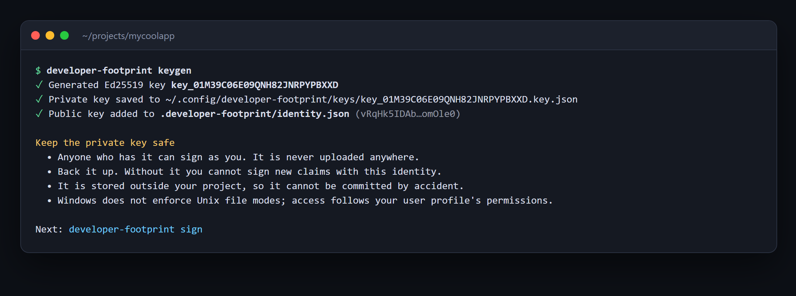

The **private key stays on your machine**, outside the project (so it cannot be committed by
accident), and is never uploaded. Back it up. If you lose it you cannot sign new claims.

### 3. Sign

```bash
npx developer-footprint sign
```

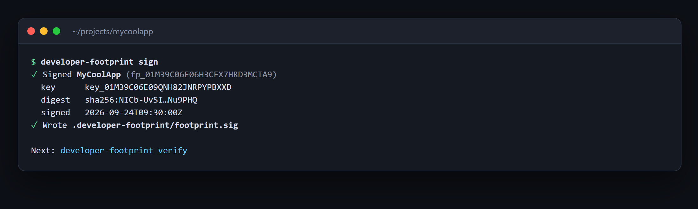

### 4. Verify (offline)

```bash
npx developer-footprint verify
```

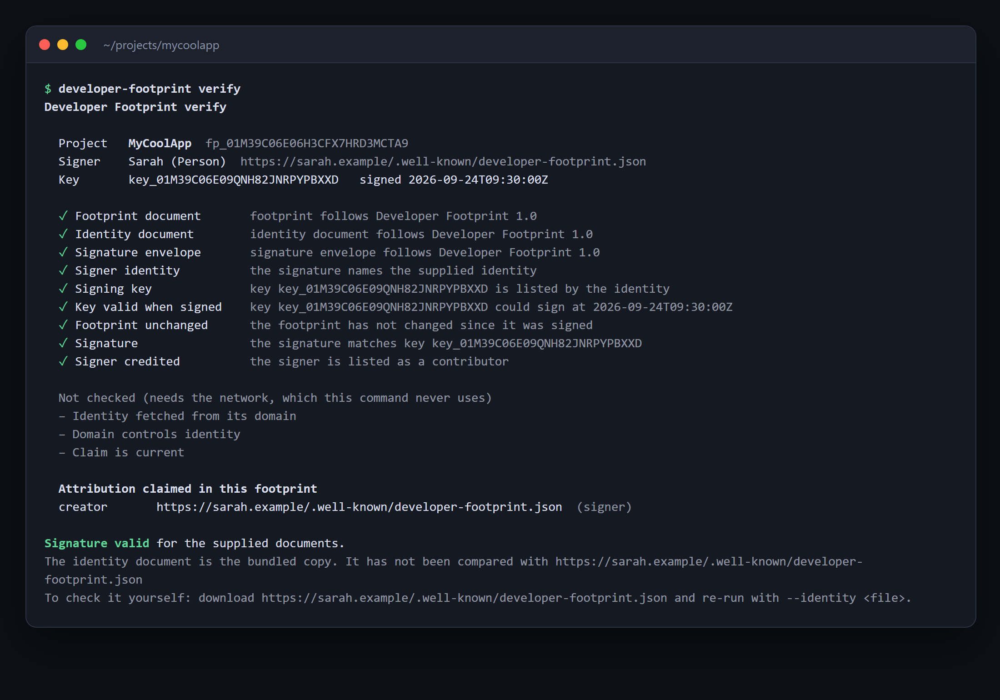

Note what it does **not** claim. It lists three things it did not check (identity fetched from its
domain, domain controls the identity, claim is current) and tells you the identity document was the
bundled copy. See [How verification works](#how-verification-works).

### 5. Catch tampering

Change one word after signing, for example quietly promote `creator` to `owner`:

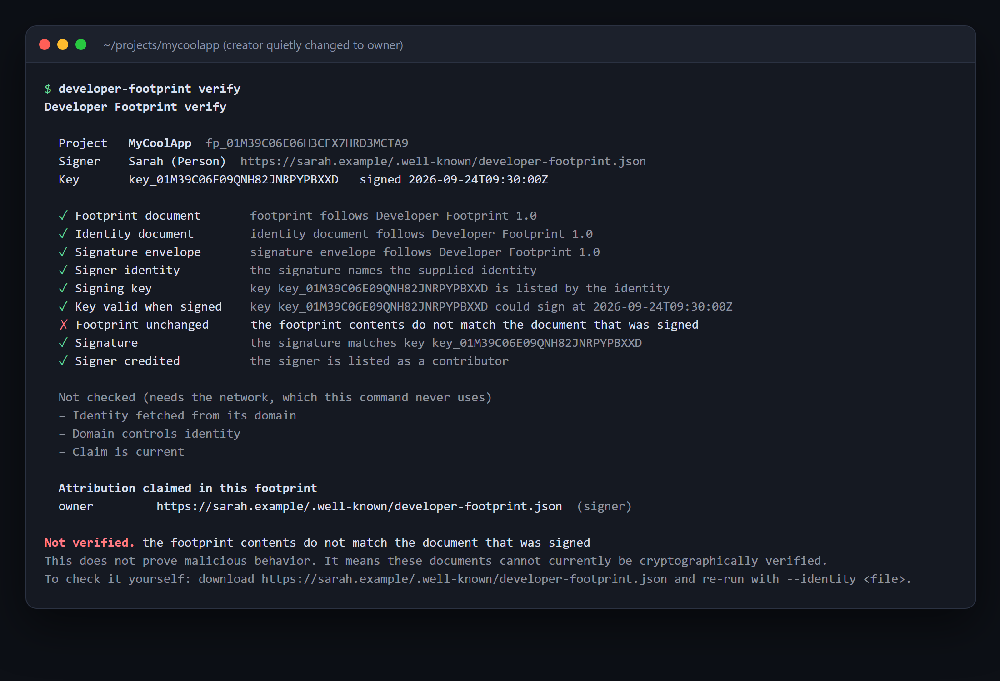

The failed check is `Footprint unchanged`; the signature itself is still intact, so you can see
exactly what broke. Exit code `1` makes it usable in CI.

### 6. Show it on your site

```bash
npx developer-footprint export --badge
```

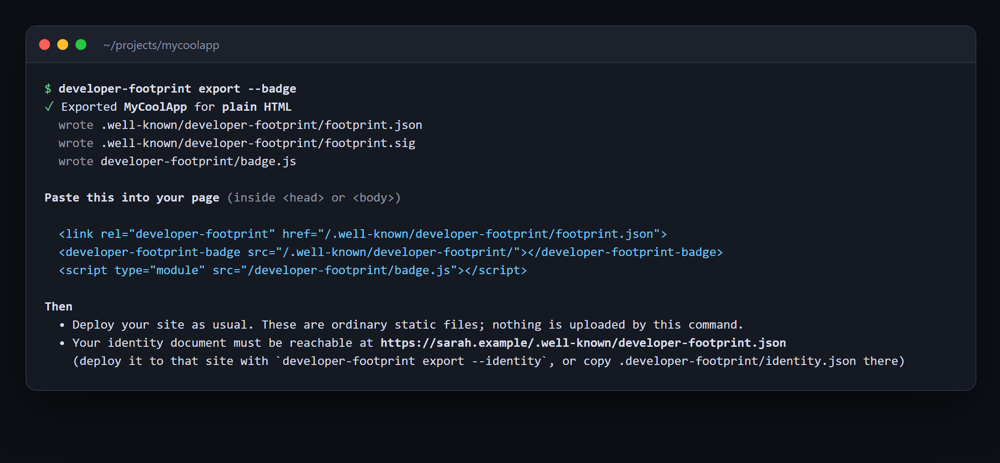

This writes plain static files into your site's public folder (it detects Next.js, Astro, Vite,
Nuxt, SvelteKit, Hugo, Jekyll and more) and prints the snippet to paste. Nothing is uploaded: you
deploy the files like any other. Details in [Put it on a website](#put-it-on-a-website).

---

## How verification works

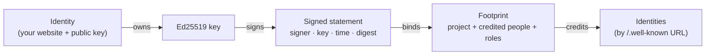

The signature covers a **statement** that includes the signer, the key id, the time, and a SHA-256
digest of the canonical footprint. So a signature can't be moved to another footprint, attributed to
another key, or re-dated.

`verify` reports every check separately instead of one green tick:

| Check                                                                                                       | What it establishes                                                            |
| ----------------------------------------------------------------------------------------------------------- | ------------------------------------------------------------------------------ |
| Footprint / identity / signature documents                                                                  | Each follows Developer Footprint 1.0 (strict, unknown fields rejected)         |
| Signer identity                                                                                             | The signature names the identity you supplied (URL **and** id)                 |
| Signing key / Key valid when signed                                                                         | The key is listed, and was allowed to sign at that time (rotation, revocation) |
| Footprint unchanged                                                                                         | The footprint's canonical digest matches what was signed                       |
| Signature                                                                                                   | Ed25519 signature verifies                                                     |
| Signer credited                                                                                             | The signer is one of the credited contributors                                 |
| **Not checked offline:** identity fetched from its domain · domain controls the identity · claim is current | Reported as `not_checked`, never assumed                                       |

### What "valid" does and does not mean

**Valid** means: these documents are well-formed, and the holder of a key listed in the supplied
identity document signed exactly this footprint.

It does **not** mean the identity document is the one the signer's own website publishes. If a
footprint ships with a bundled identity document, an attacker can ship their **own** document that
claims someone else's URL, sign with their own key, and it will verify against that copy. Offline
verification cannot detect that, which is exactly why those checks exist and are labelled. To check
_who_ signed:

```bash
curl -o sarah.json https://sarah.example/.well-known/developer-footprint.json
npx developer-footprint verify --identity sarah.json
```

The [browser badge](#put-it-on-a-website) does this for you: it fetches the identity from the
signer's own domain, refuses redirects to other sites, and only then reports those two checks as
passed. "Claim is current" (not superseded or revoked) needs a registry and stays unchecked.

Roles are exactly the claim they name. Roles for _other_ people are assertions by the signer; those
people have not confirmed them (V1 has a single signer), and the tools say so.

---

## No computer of your own? A work laptop? A borrowed PC?

You do **not** need your own PC at all times, an account, or an internet registration. Here is why,
and what to do in each situation.

**Identifiers are generated locally.** An identity, project, footprint or key ID is a random
26-character ULID created on the spot. There is nothing to register or reserve, and nothing central
that hands them out. Any machine with Node.js can make one, offline:

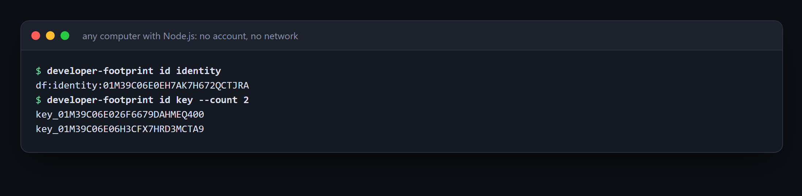

```bash
npx developer-footprint id identity        # or: project | footprint | key   (--count 5)
```

**Only one thing is precious: the private key.** Everything else (identity, footprint, signature)
is public and reproducible. So the rule is simple: _the private key lives somewhere you control,
not on the computer you happen to be using._

### If you are on a borrowed or shared computer

Put the key on **a USB stick or an encrypted folder** with `--key-dir`, so nothing secret is left on
the laptop:

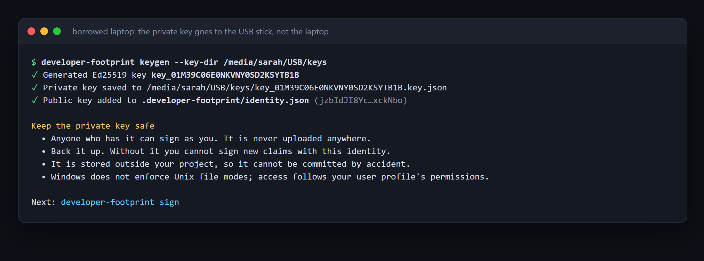

```bash
npx developer-footprint init
npx developer-footprint keygen --key-dir /media/sarah/USB/keys     # Windows: --key-dir E:\keys
```

Later, on **any** computer, plug the stick in and sign. Without it the tool explains what is missing:

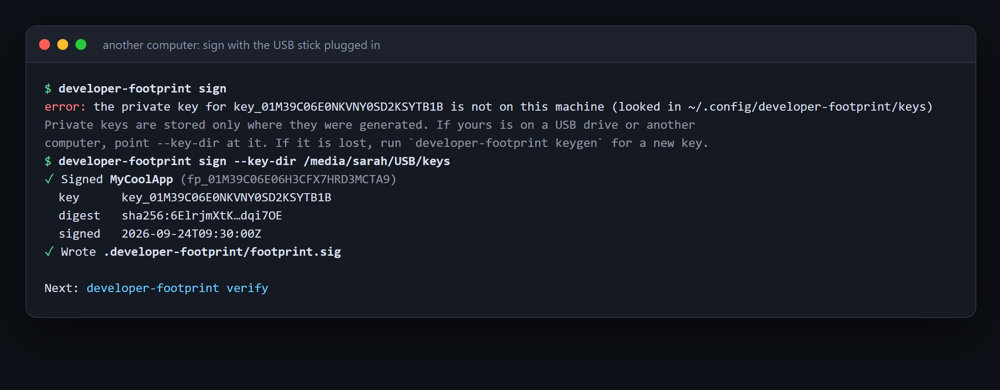

You can also set it once per session instead of passing a flag:
`export DEVELOPER_FOOTPRINT_KEY_DIR=/media/sarah/USB/keys` (PowerShell: `$env:DEVELOPER_FOOTPRINT_KEY_DIR="E:\keys"`).

### If you are on a work (employer-owned) computer

- **Do not create or store your personal signing key on a computer your employer controls.** They
  can read its disk, and a key on it is a key you no longer solely control. Use a USB stick or do
  the signing step on your own device.
- Creating the **identity and footprint files is harmless anywhere**; they are public. Only
  `sign` needs the key. You can prepare `.developer-footprint/` at work, commit it, and sign later at home.
- **Work that belongs to the company** is the company's claim to make. Use an **`Organization`
  identity** whose key the company controls (`init --type organization`), and credit people with
  explicit roles. Your personal identity is for what is yours.
- Locked-down laptop that will not let you install software? `npx` needs no install and no admin
  rights, only Node.js 22+. If Node itself is not allowed, use one of the options below.

### If there is no computer you can rely on at all

- **A disposable cloud shell** (for example GitHub Codespaces, or any online Linux terminal with
  Node.js 22+) runs the same commands. Treat it as borrowed: use `--key-dir` to a place that
  survives (a mounted drive, or copy the single `key_….key.json` file out into your password manager
  or encrypted storage before closing it), then delete it.
- **A phone or a browser-only environment is not supported yet.** A client-side, offline identity
  and key generator for the browser is planned and **not built**; it would have to run entirely in
  your browser so the key never leaves it.

### Keys: back up, don't lose, don't share

| Situation                | What to do                                                                                                                                                                                    |
| ------------------------ | --------------------------------------------------------------------------------------------------------------------------------------------------------------------------------------------- |
| Backup                   | Copy `key_….key.json` to your password manager or encrypted storage. It is small.                                                                                                             |
| Lost the key             | You can no longer sign as that key. Run `keygen` for a new one and re-sign. Old signatures still verify against the old key's validity window.                                                |
| Key exposed              | Edit your `identity.json`: set `revokedAt` on that key, add a new key, re-host the file. (A dedicated `revoke` command is not built yet; the data model and verification already support it.) |
| Moving to a new computer | Copy the key file. There is no account to migrate; the identity is just files.                                                                                                                |

---

## Put it on a website

The protocol is static JSON files plus a JavaScript verifier, so it works on **any** site.
`npx developer-footprint export --badge` writes:

```text
<site folder>/
├── .well-known/
│   ├── developer-footprint/
│   │   ├── footprint.json        your signed footprint
│   │   └── footprint.sig         its signature
│   └── developer-footprint.json  your identity (only with --identity, on YOUR own site)
└── developer-footprint/
    └── badge.js                  the self-contained verifier + badge (only with --badge)
```

Where is the "site folder"? `export` detects it, or you pass `--out`:

| Site type                                       | Folder                                   |     | Site type                     | Folder                       |
| ----------------------------------------------- | ---------------------------------------- | --- | ----------------------------- | ---------------------------- |
| Plain HTML                                      | the folder with `index.html` (`--out .`) |     | SvelteKit, Gatsby, Docusaurus | `static/`                    |
| Next.js, Astro, Nuxt, Remix                     | `public/`                                |     | Hugo                          | `static/`                    |
| Vite (React, Vue, Svelte, Solid…), CRA, Vue CLI | `public/`                                |     | Jekyll / GitHub Pages         | site root, see below         |
| Angular                                         | `public/`                                |     | Eleventy                      | site root + passthrough copy |

### Plain HTML: one script tag


```html
<developer-footprint-badge src="/.well-known/developer-footprint/"></developer-footprint-badge>
<script type="module" src="/developer-footprint/badge.js"></script>
```

Optionally also add `<link rel="developer-footprint" href="/.well-known/developer-footprint/footprint.json">`
to the `<head>` (a proposed convention that lets tools find the footprint). Try the example locally:

```bash
pnpm install && pnpm example          # http://127.0.0.1:4173/  (and /tampered.html)
```

Dark mode follows the visitor's preference (or set `theme="dark"` / `theme="light"`):

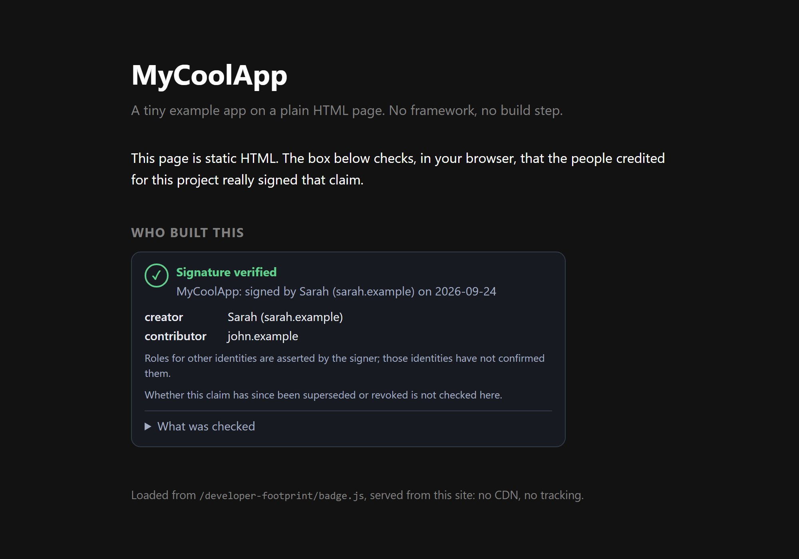

When the checks fail, the badge says so without accusing anyone:

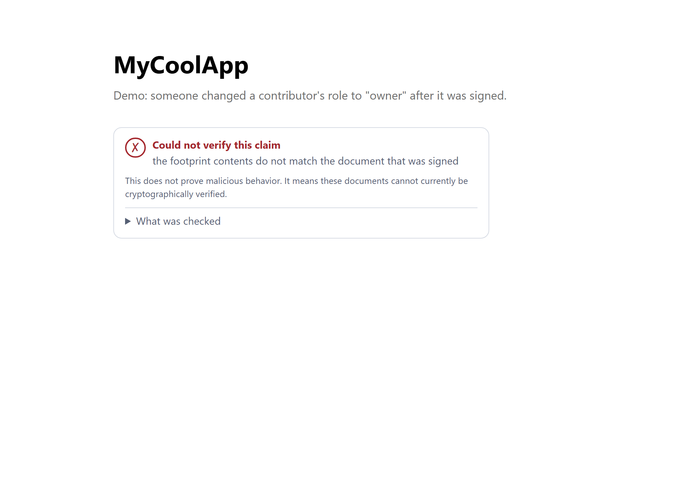

**Attributes:** `src` (folder with `footprint.json` and `footprint.sig`), `footprint` / `signature`
(full URLs), `identity` (URL of the signer's identity; omit it to fetch from the signer's domain),
`theme`. **Events:** `footprint-verified`, `footprint-invalid`, `footprint-error`. See
[`packages/web`](packages/web/README.md).

### Frameworks

The badge is a standard [custom element](https://developer.mozilla.org/docs/Web/API/Web_components/Using_custom_elements),
so it works in every framework the same way: register it once in the browser, then use the tag.
Importing the package is safe during server-side rendering (it touches no DOM until you register).

> Plain HTML is tested end to end in a real browser (including a strict CSP with Trusted Types).
> The framework snippets below rely on standard custom-element support and are **not separately
> tested** in this repository's CI.

```bash
npm install @developer-footprint/web
```

<details>
<summary><b>React and Next.js</b></summary>

```tsx
"use client"; // Next.js App Router: the badge runs in the browser
import { useEffect } from "react";

export function FootprintBadge({ src }: { src: string }) {
  useEffect(() => {
    void import("@developer-footprint/web").then((m) => m.defineFootprintBadge());
  }, []);
  return <developer-footprint-badge src={src} />;
}
```

TypeScript needs to know the tag exists (React 19 typings):

```ts
// footprint.d.ts
declare module "react" {
  namespace JSX {
    interface IntrinsicElements {
      "developer-footprint-badge": React.DetailedHTMLProps<
        React.HTMLAttributes<HTMLElement>,
        HTMLElement
      > & {
        src?: string;
        identity?: string;
        theme?: "light" | "dark" | "auto";
      };
    }
  }
}
```

Put the exported files in `public/`.

</details>

<details>
<summary><b>Vue and Nuxt</b></summary>

```ts
// vite.config.ts (Vue)
vue({
  template: { compilerOptions: { isCustomElement: (tag) => tag === "developer-footprint-badge" } },
});
// main.ts
import "@developer-footprint/web/register";
```

```ts
// nuxt.config.ts
export default defineNuxtConfig({
  vue: { compilerOptions: { isCustomElement: (tag) => tag === "developer-footprint-badge" } },
});
// plugins/footprint.client.ts   (".client" = browser only)
import "@developer-footprint/web/register";
```

```vue
<developer-footprint-badge src="/.well-known/developer-footprint/" />
```

</details>

<details>
<summary><b>Svelte and SvelteKit</b></summary>

```svelte
<script>
  import { onMount } from "svelte";
  onMount(() => import("@developer-footprint/web/register"));
</script>

<developer-footprint-badge src="/.well-known/developer-footprint/"></developer-footprint-badge>
```

Put the exported files in `static/`.

</details>

<details>
<summary><b>Astro</b></summary>

```astro
<developer-footprint-badge src="/.well-known/developer-footprint/"></developer-footprint-badge>
<script>
  import "@developer-footprint/web/register";
</script>
```

</details>

<details>
<summary><b>Angular</b></summary>

```ts
// main.ts
import "@developer-footprint/web/register";

// your component (or module)
@Component({ schemas: [CUSTOM_ELEMENTS_SCHEMA], /* … */ })
```

```html
<developer-footprint-badge src="/.well-known/developer-footprint/"></developer-footprint-badge>
```

After `ng build`, check that `dist/` contains `.well-known/`: some asset globs skip folders that
start with a dot.

</details>

<details>
<summary><b>Static site generators (Hugo, Jekyll, Eleventy) and GitHub Pages</b></summary>

- **Hugo:** files go in `static/`; paste the snippet into a partial.
- **Eleventy:** add `eleventyConfig.addPassthroughCopy(".well-known")` and `"developer-footprint"`.
- **Jekyll / GitHub Pages:** Jekyll skips dot-folders. Add `include: [".well-known"]` to `_config.yml`
  (or put an empty `.nojekyll` file at the site root to turn Jekyll off).

</details>

<details>
<summary><b>WordPress, Wix, Squarespace and other CMSs</b></summary>

Two things are needed: (1) the files must be reachable at `/.well-known/developer-footprint/…` and
`/developer-footprint/badge.js` on your domain: upload them by SFTP/file manager, and note that some
hosts hide dot-folders; (2) paste the two-line snippet into a "Custom HTML" block or the theme
footer. Some CMSs strip `<script type="module">` from page content; put it in the footer/theme.
Hosted builders that do not let you serve files from `/.well-known/` cannot host the identity
document; the identity must live on the domain it names.

</details>

### Two files, two websites

Your **identity document** lives on _your_ site (the one in your identity's `canonicalUrl`):
`https://sarah.example/.well-known/developer-footprint.json`. Your **project's footprint** lives on
the _project's_ site. They are usually different sites, so:

- On **your** site: `npx developer-footprint export --identity --site https://sarah.example`
- On the **project's** site: `npx developer-footprint export --badge`

`export --identity` refuses to write your identity for a different `--site`, because an identity
document is only valid on the domain it names.

### Serve the identity with CORS

A badge on `mycoolapp.example` reads your identity from `sarah.example`, so `sarah.example` must
allow cross-origin reads of that one file:

<details>
<summary><b>Netlify / Cloudflare Pages (<code>_headers</code>)</b></summary>

```text
/.well-known/developer-footprint.json
  Access-Control-Allow-Origin: *
  Content-Type: application/json
```

</details>

<details>
<summary><b>Vercel (<code>vercel.json</code>)</b></summary>

```json
{
  "headers": [
    {
      "source": "/.well-known/developer-footprint.json",
      "headers": [
        { "key": "Access-Control-Allow-Origin", "value": "*" },
        { "key": "Content-Type", "value": "application/json" }
      ]
    }
  ]
}
```

</details>

<details>
<summary><b>nginx / Apache</b></summary>

```nginx
location = /.well-known/developer-footprint.json {
  add_header Access-Control-Allow-Origin "*";
  default_type application/json;
}
```

```apache
<Files "developer-footprint.json">
  Header set Access-Control-Allow-Origin "*"
</Files>
```

</details>

GitHub Pages generally sends `Access-Control-Allow-Origin: *` for its static files already; check
with `curl -I`. If a site can't send the header, verify at **build time** instead with
`npx developer-footprint verify --identity <file>` in your CI.

### Privacy of the badge

The badge's requests carry no cookies and no `Referer`, follow redirects only within the same site,
and parse JSON strictly. It does make a request from the visitor's browser to the signer's domain to
fetch the identity document. If you would rather not have visitors do that, verify at build time and
skip the badge.

---

## CLI reference

```text
developer-footprint <command> [options]

  init      Create an identity and project footprint (interactive, or all flags)
  keygen    Generate a signing key; add its public half to your identity
  sign      Sign the footprint with your key
  verify    Verify a signed footprint, offline
  validate  Check the documents against the protocol
  export    Write static files for a website (plain HTML or any framework)
  doctor    Diagnose this machine and project
  id        Print a fresh identifier (works on any machine, offline)
```

**Exit codes:** `0` success · `1` documents were checked and are not valid · `2` could not run (bad
arguments, missing or unreadable file). `verify --json` and `validate --json` print machine-readable
results.

| Command  | Notable options                                                                                                                                                                                             |
| -------- | ----------------------------------------------------------------------------------------------------------------------------------------------------------------------------------------------------------- |
| `init`   | `--type` `--name` `--url` `--github` `--linkedin` `--project-name` `--project-url` `--repository` `--role` `--contributor <url>=<role>` (repeatable) `--identity-file <path>` (reuse an identity) `--force` |
| `keygen` | `--key-dir <path>` (where the private key goes)                                                                                                                                                             |
| `sign`   | `--key <key-id>` `--key-dir <path>`                                                                                                                                                                         |
| `verify` | `--identity <file>` (the signer's own document) `--footprint` `--signature` `--json`                                                                                                                        |
| `export` | `--out <dir>` `--site <url>` `--identity` `--badge`                                                                                                                                                         |
| `id`     | `identity` \| `project` \| `footprint` \| `key`, `--count <n>`                                                                                                                                              |

All commands accept `--dir <path>` (project directory) and `--help`.

**Where files live.** In your project: `.developer-footprint/{identity.json, footprint.json, footprint.sig}`.
Private keys: `--key-dir`, else `DEVELOPER_FOOTPRINT_KEY_DIR`, else `~/.config/developer-footprint/keys`
(`%APPDATA%\developer-footprint\keys` on Windows), one owner-only `key_….key.json` file per key,
never overwritten. `doctor` shows what is where:

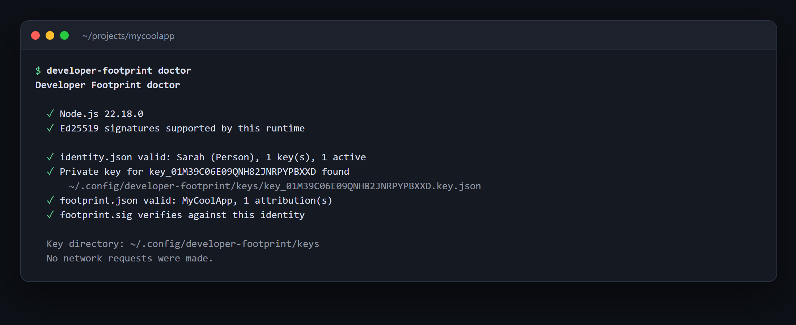

`validate` checks schema, supported version, URL safety, roles, duplicates and canonical form:

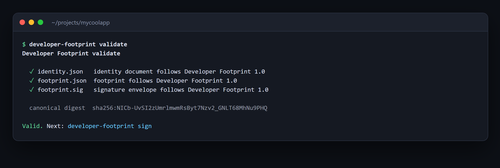

## SDK

```bash
npm install @developer-footprint/core        # zero runtime dependencies, no I/O
```

```ts
import {
  createIdentity,
  addIdentityKey,
  createFootprint,
  generateKeyPair,
  generateId,
  signFootprint,
  verifyFootprint,
  unwrap,
} from "@developer-footprint/core";

const person = unwrap(
  createIdentity({ type: "Person", name: "Sarah", canonicalUrl: "https://sarah.example" }),
);
const { publicKey, privateKey } = unwrap(await generateKeyPair());
const keyId = generateId("key");
const identity = unwrap(addIdentityKey(person, { id: keyId, publicKey }));
const footprint = unwrap(
  createFootprint({
    project: { name: "MyCoolApp" },
    contributors: [{ identity, role: "creator" }],
  }),
);
const signature = unwrap(await signFootprint({ footprint, identity, keyId, privateKey }));
const result = await verifyFootprint({ footprint, signature, identity }); // { valid, checks, warnings, errors }
```

Validation returns `{ ok, value | error }` with stable error codes and JSON-Pointer issues instead of
throwing. The core is deterministic and portable (Node, browsers, edge). See
[`packages/core`](packages/core/README.md). To fetch documents in the browser, use
`loadAndVerify` from `@developer-footprint/web`.

---

## Security and privacy model

Everything external is treated as hostile.

- **No hidden network, no telemetry.** Core has no I/O of any kind, enforced by the TypeScript
  config (no Node types), ESLint (bans network globals and `node:*` imports), and a test that
  stubs every network API to throw while running the whole pipeline.
- **Strict parsing.** Duplicate JSON keys, lone surrogates, fractions, deep nesting and oversized
  input are rejected (`JSON.parse` silently keeps the last duplicate). `__proto__` cannot pollute.
- **Strict validation.** Unknown fields are rejected; nothing is coerced. URLs must be normalized
  `https` public DNS names (no `javascript:`, credentials, IP literals, `localhost`, internal
  suffixes); IDNs must be Punycode so lookalikes are visible. Names reject control, bidirectional
  and invisible characters. Markup is inert text.
- **Canonical signing.** RFC 8785-based canonical JSON (integers only); the signature covers signer,
  key, time and footprint digest.
- **Weak keys rejected.** WebCrypto accepts small-order Ed25519 keys under which a forged signature
  verifies for _every_ message; core rejects them.
- **Keys.** Never uploaded, logged or committed. The CLI writes them outside the project, `0600`,
  no overwrite. A `PrivateKey` prints as `[REDACTED …]`. Key ids can't traverse paths.
- **Browser badge.** `textContent` only; passes a strict CSP with Trusted Types; credential-free,
  referrer-free requests; same-origin redirects only.
- **Explicit, honest verification.** Every check reported separately; offline verification labels
  what it cannot know.

Known limitations (also in [`SECURITY.md`](SECURITY.md)): a bundled identity document can't prove the
signer's domain (see above); `signedAt` is self-asserted, so revocation can't be enforced offline;
V1 is single-signer. Report vulnerabilities privately.

The full rules are in the [specification](spec/SPEC.md); design decisions are in
[`docs/adr`](docs/adr).

## Repository layout

```text
spec/            SPEC.md (normative), JSON Schemas, test vectors, examples
packages/core/   @developer-footprint/core   parse · validate · canonicalize · sign · verify
packages/web/    @developer-footprint/web    <developer-footprint-badge> + loadAndVerify
packages/cli/    developer-footprint         the command line
examples/        plain-html: a runnable static site
docs/adr/        architecture decision records
tooling/         generators for vectors, the example and these screenshots
ARCHITECTURE.md  the engineering baseline this project follows
```

```bash
pnpm install
pnpm check              # format · lint · build · typecheck · test
pnpm example            # serve examples/plain-html
pnpm vectors            # regenerate spec/test-vectors (and re-check them via the tests)
pnpm docs:screenshots   # regenerate every image in this README from the real tools
```

The screenshots are generated by `pnpm docs:screenshots`: the terminal images are the real CLI's
output (paths shortened for display), and the browser images are the real example page rendered by
Chrome. They were taken on Windows 11, which is why `keygen` mentions Windows file permissions.

## Status: what is and is not built

This is **pre-release (0.x)**, and the protocol is a **draft** (`spec/SPEC.md`). It follows the build
order in [`ARCHITECTURE.md`](ARCHITECTURE.md): protocol first, hosted service last.

| Built and tested                                                                                                                                                      |                                   |
| --------------------------------------------------------------------------------------------------------------------------------------------------------------------- | --------------------------------- |
| Specification draft, JSON Schemas, language-independent test vectors (checked against the SDK **and** independently via `node:crypto`)                                | ✅                                |
| `@developer-footprint/core`: strict parse, validation, canonicalization, Ed25519 sign/verify, key rotation/revocation windows, weak-key rejection                     | ✅ 315 tests                      |
| CLI: `init` `keygen` `sign` `verify` `validate` `export` `doctor` `id`                                                                                                | ✅ 70 tests                       |
| `@developer-footprint/web`: loader, `<developer-footprint-badge>`, self-contained bundle; **real-browser test** of a plain HTML page under strict CSP + Trusted Types | ✅ 35 tests                       |
| Framework integration (React, Vue, Nuxt, Svelte, Astro, Angular)                                                                                                      | documented; not separately tested |

| **Not built yet**                                                                                                 |     |
| ----------------------------------------------------------------------------------------------------------------- | --- |
| `resolve` and `publish` commands; a server-side resolver package with SSRF defenses                               | ❌  |
| Hosted registry (API, database, public pages, search, rate limiting, caching) and self-hosting kit                | ❌  |
| Key rotation / revocation commands (the data model and verification support them; today you edit `identity.json`) | ❌  |
| Browser-based (client-side) identity and key generator for people with no Node.js                                 | ❌  |
| OS keychain storage for keys (file storage with owner-only permissions today)                                     | ❌  |
| Countersignatures, GitHub Action, other-language implementations, Changesets/Turborepo                            | ❌  |
| Dogfooding on a real domain: needs your domain and your key                                                       | ❌  |

The GitHub Actions workflow (`.github/workflows/ci.yml`) is written but has not run yet.

## FAQ

**Do I need an account?** No. There is nothing to sign up for; IDs and keys are generated locally.

**Does it phone home?** No. The SDK and CLI make no network requests and collect nothing. The only
network activity is the browser badge fetching your signer's public identity document when a page
loads it, and only if you put the badge on a page.

**What if my website goes away?** Signed footprints still verify offline against an identity
document you keep. The domain is the root of trust for "who is this", so keep it or re-issue.

**Can two people both claim to be the creator?** Each footprint has a signer and credits others by
role; nothing stops conflicting claims, and V1 has no countersignature. Roles are claims, not proof
of exclusive ownership, and the tools present them that way.

**Is a `creator` the same as an `owner`?** No. Each role is exactly the claim it names.

**Can I change a footprint later?** Sign a new one (optionally with `supersedes`). Signed history is
never rewritten, and a superseded footprint remains cryptographically valid: validity and current
status are separate questions.

**Is the private key in my repo?** Never. It is stored outside the project, and `*.key.json` is
git-ignored as a second line of defense.

## Contributing, security, licence

Read [`ARCHITECTURE.md`](ARCHITECTURE.md) and [`CONTRIBUTING.md`](CONTRIBUTING.md). Report
vulnerabilities per [`SECURITY.md`](SECURITY.md). Released under the [MIT licence](LICENSE).
